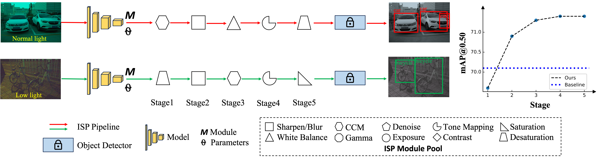

# [NeurIPS2024] AdaptiveISP: Learning an Adaptive Image Signal Processor for Object Detection
### [Project Page](https://openimaginglab.github.io/AdaptiveISP/) | [Paper](https://arxiv.org/pdf/2410.22939) | [Data (Baidu Drive)](https://pan.baidu.com/s/1J0tLRr4IcxPxogcoKKs3Hw?pwd=nips) | [Data (OneDrive)](https://1drv.ms/u/s!Aq1PSygduHX9czHB9WkUNUTUx8o?e=KURDwo) <br>

Yujin Wang, Tianyi Xu, Fan Zhang, Tianfan Xue, Jinwei Gu <br><br>

<p align="left" width="100%">
    
</p>
    AdaptiveISP takes a raw image as input and automatically generates an optimal ISP pipeline $\{M_i\}$ and the associated ISP parameters $\{\Theta_i\}$ to maximize the detection performance for any given pre-trained object detection network with deep reinforcement learning. AdapativeISP achieved mAP@0.5 of 71.4 on the dataset LOD dataset, while a baseline method with a fixed ISP pipeline and optimized parameters can only achieve mAP@0.5 of 70.1. Note that AdaptiveISP predicts the ISP for the image captured under normal light requires a CCM module, while the ISP for the image captured under low light requires a Desaturation module.

## Abstract
Image Signal Processors (ISPs) convert raw sensor signals into digital images, which significantly influence the image quality and the performance of downstream computer vision tasks. 
Designing an ISP pipeline and tuning ISP parameters are two key steps for building an imaging and vision system.
To find optimal ISP configurations, recent works use deep neural networks as a proxy to search for ISP parameters or ISP pipelines. However, these methods are primarily designed to maximize the image quality, which are sub-optimal in the performance of high-level computer vision tasks such as detection, recognition, and tracking. Moreover, after training, the learned ISP pipelines are mostly fixed at the inference time, whose performance degrades in dynamic scenes. 
To jointly optimize ISP structures and parameters, we propose AdaptiveISP, a task-driven and scene-adaptive ISP. 
One key observation is that for the majority of input images, only a few processing modules are needed to improve the performance of downstream recognition tasks, and only a few inputs require more processing.
Based on this, AdaptiveISP utilizes deep reinforcement learning to automatically generate an optimal ISP pipeline and the associated ISP parameters to maximize the detection performance. Experimental results show that AdaptiveISP not only surpasses the prior state-of-the-art methods for object detection but also dynamically manages the trade-off between detection performance and computational cost, especially suitable for scenes with large dynamic range variations.

## Installation
### Set up the python environment
```
conda create -n adaptiveisp python=3.10
conda activate adaptiveisp
conda install pytorch==2.0.1 torchvision==0.15.2 torchaudio==2.0.2 pytorch-cuda=11.8 -c pytorch -c nvidia

git clone https://github.com/OpenImagingLab/AdaptiveISP.git
cd AdaptiveISP
pip install -r requirements.txt
```

## Prepare Dataset
1. Download the LOD dataset from [Baidu Drive](https://pan.baidu.com/s/1J0tLRr4IcxPxogcoKKs3Hw?pwd=nips) or [OneDrive](https://1drv.ms/u/s!Aq1PSygduHX9czHB9WkUNUTUx8o?e=KURDwo).
2. Unzip the LOD, and modify the dataroot yolov3/data/lod.yaml

## Training and Test
### Training
To train the AdaptiveISP model:
1. Modify the dataroot yolov3/data/lod.yaml
2. Training without runtime_penalty
    ```bash
    CUDA_VISIBLE_DEVICES=0 python train.py \
        --batch_size=8 \
        --data_name=lod \
        --data_cfg=yolov3/data/lod.yaml \
        --save_path=adaptive-isp
    ```
3. Training with runtime_penalty
    ```bash
    CUDA_VISIBLE_DEVICES=0 python train.py \
        --batch_size=8 \
        --add_noise=False \
        --data_name=lod \
        --data_cfg=yolov3/data/lod.yaml \
        --save_path=adaptive-isp \
        --runtime_penalty \
        --runtime_penalty_lambda=5e-3
    ```

### Test
Test the AdaptiveISP model on the LOD dataset:
1. Modify the data root yolov3/data/lod.yaml
2. Download the pre-trained model and put it in pre-trained folder. 

    - [ckpt-lod-df-1.0](https://github.com/OpenImagingLab/AdaptiveISP/releases/download/v1.0/ckpt-lod-df-0.98.pth): training with discount factor (1.0)

    - [ckpt-lod-df-0.98](https://github.com/OpenImagingLab/AdaptiveISP/releases/download/v1.0/ckpt-lod-df-1.0.pth): training with discount factor (0.98)

    - [yolov3](https://github.com/OpenImagingLab/AdaptiveISP/releases/download/v1.0/yolov3.pt): pre-trained model on COCO

2. Run
    ```bash
    CUDA_VISIBLE_DEVICES=0 python yolov3/val_adaptiveisp.py \
        --project=results \
        --isp_weights=pretrained/ckpt-lod-df-1.0.pth \
        --data_name=lod \
        --data=yolov3/data/lod.yaml \
        --batch-size=1 \
        --steps=5 \
        --name=adptiveisp \
        --save_image \
        --save_param
    ```

## Posterior-Information-Guided Low-Light RAW ISP

本仓库在原始 **AdaptiveISP** 框架之上扩展了一个面向论文《基于互信息的暗光 RAW 图像 ISP 参数优化方法研究》的实验版本。原始 AdaptiveISP 的核心思想是：给定 RAW 图像，使用强化学习自动选择 ISP pipeline 中的处理模块及其参数，使冻结的目标检测器获得更好的检测性能。本扩展沿用这一任务驱动 ISP 思路，但将 reward 从单纯依赖检测损失 / mAP 的稀疏反馈，扩展为“检测性能奖励 + 检测后验信息奖励”。

### Method Overview

给定暗光 RAW 图像 $x$ 和参数化 ISP 管线 $G(\cdot; a)$，处理后的 RGB 图像为：

```math
 y_a = G(x; a),
```

其中 $a$ 表示 ISP 参数或由 AdaptiveISP agent 逐步选择的 ISP 操作及参数。固定 YOLOv3 检测器 $F$ 后，检测器对 $y_a$ 输出候选框、objectness 和类别后验：

```math
F(y_a)=\{(b_i, q_i, \mathbf{p}_i)\}_{i=1}^{N_a}.
```

本文实验把暗光 ISP 参数优化理解为任务相关信息最大化问题：

```math
\arg\max_a I(Z_a;T)=\arg\min_a H(T|Z_a),
```

其中 $Z_a=\Phi_F(y_a)$ 是冻结检测器从 ISP 输出中提取的任务表示，$T$ 表示目标存在性、类别和位置等检测任务变量。由于真实的结构化检测条件熵难以直接计算，代码中使用 YOLO 输出的类别后验熵和 objectness 后验熵作为代理。

### Posterior Information Reward

对每个候选框 $i$，类别后验熵定义为：

```math
H_{\mathrm{cls}}^{(i)}=-\sum_{c=1}^{C}p_i(c)\log(p_i(c)+\epsilon).
```

Objectness 后验熵定义为：

```math
H_{\mathrm{obj}}^{(i)}=-q_i\log(q_i+\epsilon)-(1-q_i)\log(1-q_i+\epsilon).
```

为了突出更可能包含目标的候选框，代码使用 objectness 加权：

```math
w_i=\frac{q_i}{\sum_j q_j+\epsilon}.
```

聚合后的检测后验熵为：

```math
\mathcal{H}_{\mathrm{det}}(a)=\mathcal{H}_{\mathrm{cls}}(a)+\beta\mathcal{H}_{\mathrm{obj}}(a),
```

归一化后的后验信息奖励为：

```math
R_{\mathrm{post}}(a)=1-\frac{\mathcal{H}_{\mathrm{cls}}(a)+\beta\mathcal{H}_{\mathrm{obj}}(a)}{\log C+\beta\log 2}.
```

最终强化学习 reward 为：

```math
R_{\mathrm{new}}=\lambda_{\mathrm{det}}R_{\mathrm{det}}+\lambda_{\mathrm{info}}R_{\mathrm{post}}-P_{\mathrm{artifact/param}},
```

其中 $R_{\mathrm{det}}$ 仍来自原 AdaptiveISP 中检测损失改善带来的任务奖励，$R_{\mathrm{post}}$ 提供更加密集的检测不确定性反馈，原有 penalty 继续用于抑制过度处理、极端参数或额外代价。

### Code Structure

- `train.py`: 原 AdaptiveISP 训练入口。现在会在 YOLOv3 对 retouched image 的输出上计算 posterior-information reward，并和 detection reward 加权融合。
- `posterior_info.py`: 新增的后验信息奖励实现，负责展平 YOLO detection heads，计算 $H_{\mathrm{cls}}$、$H_{\mathrm{obj}}$、$\mathcal{H}_{\mathrm{det}}$ 和 $R_{\mathrm{post}}$。
- `docs/posterior_information_experiment.md`: 记录 mAP-only baseline、posterior-information-guided 训练命令和消融设置。
- `config.py`: 保留 AdaptiveISP 的 ISP filter、强化学习和 replay memory 配置。
- `yolov3/`: 冻结的下游 YOLOv3 检测器代码和数据集 YAML 配置。

### Running the Experiments

#### 1. mAP-only / detection-only baseline

该设置对应原始任务驱动 AdaptiveISP reward，不启用 posterior-information 项：

```bash
CUDA_VISIBLE_DEVICES=0 python train.py \
    --batch_size=8 \
    --data_name=lod \
    --data_cfg=yolov3/data/lod.yaml \
    --save_path=map-only \
    --lambda_det=1.0 \
    --lambda_info=0.0
```

#### 2. Posterior-information-guided AdaptiveISP

该设置对应论文方法，在检测性能奖励之外加入后验信息奖励：

```bash
CUDA_VISIBLE_DEVICES=0 python train.py \
    --batch_size=8 \
    --data_name=lod \
    --data_cfg=yolov3/data/lod.yaml \
    --save_path=posterior-info \
    --lambda_det=1.0 \
    --lambda_info=0.25 \
    --posterior_beta=1.0 \
    --posterior_topk=1000
```

#### 3. COCO-Syn / synthetic low-light RAW training

如果使用合成暗光 RAW 数据，可以使用仓库已有的 `coco_synraw` 配置：

```bash
CUDA_VISIBLE_DEVICES=0 python train.py \
    --batch_size=8 \
    --data_name=coco \
    --data_cfg=yolov3/data/coco_synraw.yaml \
    --save_path=coco-syn-posterior-info \
    --lambda_det=1.0 \
    --lambda_info=0.25 \
    --posterior_beta=1.0 \
    --posterior_topk=1000
```

#### 4. OnePlus RAW / other real low-light RAW datasets

为 OnePlus RAW 或其他真实 RAW 检测数据准备 YOLO 格式标注后，新增一个数据集 YAML，例如 `yolov3/data/oneplus_raw.yaml`，然后运行：

```bash
CUDA_VISIBLE_DEVICES=0 python train.py \
    --batch_size=8 \
    --data_name=lod \
    --data_cfg=yolov3/data/oneplus_raw.yaml \
    --save_path=oneplus-posterior-info \
    --lambda_det=1.0 \
    --lambda_info=0.25 \
    --posterior_beta=1.0 \
    --posterior_topk=1000
```

### Important Arguments

| Argument | Meaning |
| --- | --- |
| `--lambda_det` | 检测性能奖励权重，对应 $\lambda_{\mathrm{det}}$。 |
| `--lambda_info` | 后验信息奖励权重，对应 $\lambda_{\mathrm{info}}$；设为 `0.0` 即 mAP-only / detection-only baseline。 |
| `--posterior_beta` | objectness 熵权重，对应 $\beta$；设为 `0.0` 时主要使用类别熵。 |
| `--posterior_topk` | 只使用 objectness 最高的 top-k 候选框计算后验熵，降低显存和计算开销；设为 `0` 表示使用全部候选框。 |
| `--runtime_penalty` | 启用原 AdaptiveISP 的运行代价惩罚。 |
| `--runtime_penalty_lambda` | 运行代价惩罚权重。 |

### Expected Logs and Analysis

训练过程中 TensorBoard 会记录以下与本文实验设计相关的指标：

- `reward/det_reward`: 原检测奖励部分。
- `posterior/h_cls`: objectness 加权后的类别后验熵。
- `posterior/h_obj`: objectness 加权后的 objectness 后验熵。
- `posterior/h_det`: 检测后验总熵。
- `posterior/reward`: 归一化后验信息奖励 $R_{\mathrm{post}}$。

这些日志可用于分析 $-\mathcal{H}_{\mathrm{det}}$ 与 mAP、AP50、Recall 等检测指标之间的 Pearson / Spearman 相关性，从而验证后验熵是否可以作为检测任务信息代理。

### Suggested Ablations

1. `--lambda_info=0.0`: 去掉后验信息奖励，只保留检测奖励。
2. `--posterior_beta=0.0`: 主要使用类别后验熵。
3. 增大 `--posterior_beta`: 增强 objectness 后验熵影响。
4. 扫描 `--lambda_info`，例如 `0.05 / 0.1 / 0.25 / 0.5`，分析检测性能和后验不确定性之间的权衡。
5. 对比 `--runtime_penalty` 开关，观察是否能减少过度增强和复杂 ISP pipeline。


## Citations
```
@article{wang2024adaptiveisp,
      title={AdaptiveISP: Learning an Adaptive Image Signal Processor for Object Detection}, 
      author={Yujin Wang and Tianyi Xu and Fan Zhang and Tianfan Xue and Jinwei Gu},
      booktitle={Conference on Neural Information Processing Systems},
      year={2024}
}
```

## Acknowledgements
Related research projects and implementations. We thank the original authors for their excellent work.
- [LODDataset](https://github.com/ying-fu/LODDataset)

- [YOLOv3](https://github.com/ultralytics/yolov3)
